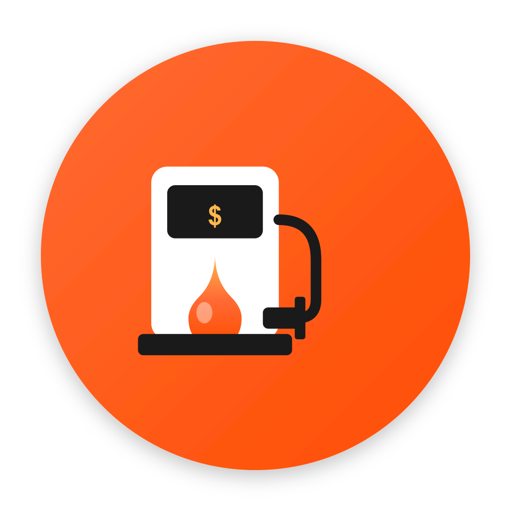

<p align="center">
  
</p>

<h1 align="center">📱 SmartFuel Mobile</h1>

<p align="center">
  Aplicación móvil para gestión de combustible y vehículos
</p>

<p align="center">
  
  
  
  
  
</p>

---

## 📋 Descripción

Aplicación móvil multiplataforma desarrollada con React Native y Expo para el control completo de combustible, vehículos, mantenimientos y rutas GPS.

---

## ✨ Características

### 🚗 Gestión de Vehículos
- Agregar múltiples vehículos (autos, motos, camionetas, buses)
- Información detallada: marca, modelo, año, placa
- Configuración de capacidad del tanque
- Seguimiento automático del odómetro

### ⛽ Control de Combustible
- Registro rápido de recargas
- Cálculo automático de galones o costo
- Soporte para cargas parciales o tanque lleno
- Geolocalización automática de la estación
- Validación: no exceder capacidad del tanque
- Historial completo de recargas

### 📊 Dashboard Inteligente
- Porcentaje de combustible restante en tiempo real
- Indicador visual con colores (verde/amarillo/rojo)
- Rendimiento promedio (km/galón)
- Proyección de gasto mensual
- Estadísticas del vehículo

### 🔧 Mantenimientos
- Programación por kilómetros o tiempo
- Alertas de mantenimientos pendientes
- Tipos: aceite, filtros, frenos, llantas, batería, etc.
- Historial de servicios realizados

### 🗺️ Rutas GPS
- Tracking en tiempo real de recorridos
- Visualización en mapa interactivo
- Distancia y duración del viaje
- Historial de rutas

### 🏪 Gasolineras Cercanas
- Búsqueda por ubicación actual
- Visualización en mapa
- Navegación directa

### 💳 Pagos
- Integración con Stripe
- Historial de transacciones
- Vouchers digitales

### 👤 Perfil de Usuario
- Foto de perfil personalizable
- Gestión de cuenta
- Verificación de email
- Recuperación de contraseña

---

## 🛠️ Stack Tecnológico

| Tecnología | Uso |
|------------|-----|
| **React Native** | Framework móvil |
| **Expo** | Plataforma de desarrollo |
| **TypeScript** | Lenguaje de programación |
| **React Navigation** | Navegación (Stack + Tabs) |
| **Axios** | Cliente HTTP |
| **Expo SecureStore** | Almacenamiento seguro |
| **Expo Location** | GPS y ubicación |
| **React Native Maps** | Mapas interactivos |
| **Expo Image Picker** | Selección de imágenes |
| **WebView** | Stripe Checkout |

---

## 📁 Estructura del Proyecto

```
fuel-mobile/
├── src/
│   ├── components/           # Componentes reutilizables
│   │   └── common/           # Button, Input, LoadingSpinner, Picker
│   ├── config/               # Configuración y constantes
│   ├── context/              # Estado global
│   │   ├── AuthContext.tsx   # Autenticación
│   │   └── VehicleContext.tsx # Vehículo seleccionado
│   ├── hooks/                # Custom hooks
│   │   └── useRouteTracker.ts # Tracking GPS
│   ├── navigation/           # Configuración de navegación
│   │   ├── AppNavigator.tsx  # Navegador principal
│   │   └── MainTabs.tsx      # Bottom tabs
│   ├── screens/              # Pantallas
│   │   ├── auth/             # Login, Register, Verify, ForgotPassword
│   │   └── main/             # Dashboard, Vehicles, Refuels, Routes...
│   ├── services/             # Servicios de API
│   │   └── api/              # Cliente HTTP y servicios
│   ├── types/                # Tipos TypeScript
│   └── utils/                # Utilidades
├── assets/
│   └── images/               # Logo y recursos gráficos
├── App.tsx                   # Punto de entrada
├── app.json                  # Configuración Expo
└── package.json
```

---

## 🚀 Instalación

### Requisitos
- Node.js 18+
- npm o yarn
- Expo CLI
- iOS Simulator / Android Emulator (o dispositivo físico)

### 1. Instalar dependencias
```bash
cd fuel-mobile
npm install
```

### 2. Configurar API
Editar `src/config/index.ts`:
```typescript
export const API_BASE_URL = 'http://TU_IP:3000';
// Para producción:
// export const API_BASE_URL = 'https://tu-servidor.com';
```

### 3. Ejecutar la app
```bash
# Iniciar Expo
npm start

# Ejecutar en iOS
npm run ios

# Ejecutar en Android
npm run android
```

---

## 📱 Pantallas

### Autenticación
| Pantalla | Descripción |
|----------|-------------|
| `LoginScreen` | Inicio de sesión |
| `RegisterScreen` | Registro de usuario |
| `VerifyEmailScreen` | Verificación de email |
| `ForgotPasswordScreen` | Recuperación de contraseña |

### Principal
| Pantalla | Descripción |
|----------|-------------|
| `DashboardScreen` | Vista principal con estadísticas |
| `VehiclesScreen` | Lista de vehículos |
| `VehicleFormScreen` | Crear vehículo |
| `VehicleDetailScreen` | Editar vehículo |
| `RefuelsScreen` | Historial de recargas |
| `RefuelFormScreen` | Registrar recarga |
| `MaintenanceScreen` | Gestión de mantenimientos |
| `RoutesScreen` | Historial de rutas |
| `RouteTrackerScreen` | Tracking GPS en vivo |
| `RouteDetailScreen` | Detalle de ruta con mapa |
| `StationsScreen` | Gasolineras cercanas |
| `PaymentsScreen` | Historial de pagos |
| `ProfileScreen` | Perfil de usuario |
| `MonthlyHistoryScreen` | Historial mensual |

---

## 🧮 Lógica de Cálculos

### Combustible Restante
```
1. Obtener galones de recargas recientes
2. Calcular km recorridos desde última recarga
3. Estimar consumo = km / rendimiento
4. Sumar remanente de recargas anteriores (si no se gastó todo)
5. Restante = galones acumulados - consumo
6. Porcentaje = restante / capacidad del tanque
```

### Indicador de Color
- 🟢 **Verde**: > 50% de tanque
- 🟡 **Amarillo**: 20-50% de tanque
- 🔴 **Rojo**: < 20% de tanque

---

## 🔐 Autenticación

La app implementa autenticación JWT con refresh tokens:

1. **Login**: Obtiene access token (15 min) + refresh token (7 días)
2. **Interceptor**: Automáticamente renueva el access token cuando expira
3. **SecureStore**: Tokens almacenados de forma segura
4. **Logout**: Invalida refresh token en servidor

---

## 📍 Permisos Requeridos

### iOS (`Info.plist`)
- `NSLocationWhenInUseUsageDescription` - GPS
- `NSLocationAlwaysUsageDescription` - GPS en background
- `NSCameraUsageDescription` - Cámara para avatar
- `NSPhotoLibraryUsageDescription` - Galería para avatar

### Android (`AndroidManifest.xml`)
- `ACCESS_FINE_LOCATION` - GPS preciso
- `ACCESS_COARSE_LOCATION` - GPS aproximado
- `ACCESS_BACKGROUND_LOCATION` - GPS en background
- `CAMERA` - Cámara
- `READ_EXTERNAL_STORAGE` - Galería

---

## 🧪 Testing

```bash
# Ejecutar tests
npm test
```

---

## 📦 Build para Producción

### Con EAS Build
```bash
# Configurar EAS
eas build:configure

# Build para iOS
eas build --platform ios

# Build para Android
eas build --platform android
```

### Build Local
```bash
# iOS
npx expo run:ios --configuration Release

# Android
npx expo run:android --variant release
```

---

## 🎨 Diseño

- **Colores principales**: Naranja (#FF6B35) y blanco
- **Fuente**: Nunito (Google Fonts)
- **Iconos**: MaterialCommunityIcons
- **Estilo**: Cards con sombras suaves, bordes redondeados

---

## 📄 Licencia

Proyecto privado - Todos los derechos reservados.
